# 楊兆尹 <span style="color:red">103020010</span>

# Project 1 / Image Filtering and Hybrid Images

## Overview
The project creates hybrid image which is composed of low frequecy image and high frequecy image. one can view the hybrid image in distinct interpretation.


## Implementation
I wrote three versions of implementation. Each has different calculation speed.
1. Version 1
* Do the convolution on each channel seperately.
* It's supposed to to be very slow since the allocation of memory is fragmented.
```
for c in range(3):
	for i in range(output.shape[0]):
		for j in range(output.shape[1]):
			im_part = image[i:i+imfilter.shape[0], j:j+imfilter.shape[1], c]
				output[i, j, c] = (im_part * imfilter).sum()
```
2. Version2
* By transpose the part of image we want to filter in order to match the format of imfilter, we can allocate larger memory size every time and do convolution with three channels together.
* But it seems that the transpose process costs lots of time so that the total calculation speed is slower than the Version1.
```
for i in range(output.shape[0]):
	for j in range(output.shape[1]):
		im_part = np.transpose(image[i:i+imfilter.shape[0], j:j+imfilter.shape[1], :], (2,0,1))
			temp = np.transpose(im_part*imfilter, (1,2,0))
				output[i, j, :] = temp.sum(axis=0).sum(axis=0)
```
3. Version3
* By replicate the imfilter 3 times on the 3rd dimension, we don't even need to transpose the part of image each time.
* We just need to modify the form of imfilter beforehand. Faster than Verison1 and Version2.
```
filter = np.repeat(imfilter[:,:,np.newaxis], 3, axis=2)
	for i in range(output.shape[0]):
		for j in range(output.shape[1]):
			im_part = image[i:i+imfilter.shape[0], j:j+imfilter.shape[1], :]
				output[i, j, :] = (im_part * filter).sum(axis=0).sum(axis=0)
```

## Speed Comparison
* I test the convolution time cost by filtering the submarine image with gaussian filter.

| v1 time | v2 time | v3 time |
|:---:|:---:|:---:|
| 2.669s | 2.800s | 1.732s |

## Hybrid Images
* Remove the high frequencies part of image1 by gaussian filter.
```
low_frequencies = my_imfilter(image1, gaussian_filter)
```
* Remove the low frequencies part of image2 by subtracting the blur version of image2 from the original image2. but after doing this operation, the high frequecy image has negative values at some pixels. We'll do normalization later to make sure the value at each pixel is between 0 and 1.
```
high_frequencies = image2 - my_imfilter(image2, gaussian_filter)
```
* Combine high frequecy image2 and low frequecy image1 together.We utilize normalization function to make sure the value of each pixel is between 0 and 1.
```
hybrid_image = normalize(low_frequencies + high_frequencies)
```


## Installation
* numpy
* matplotlib
* scipy

### Results

<table border=1>
<tr>
<td>


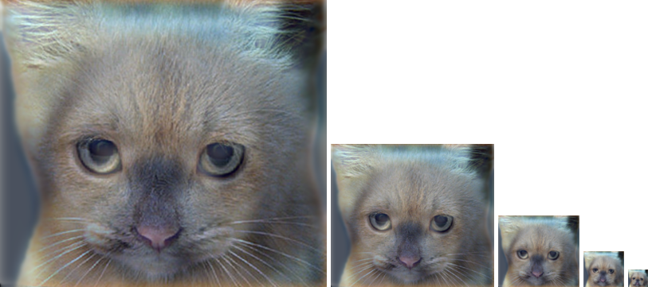
</td>
</tr>

<tr>
<td>

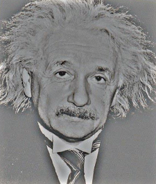
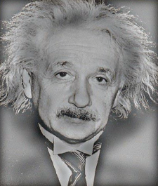
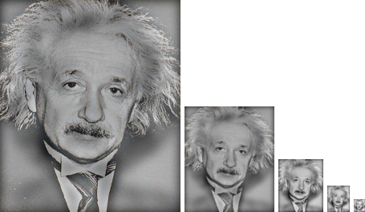
</td>
</tr>

<tr>
<td>

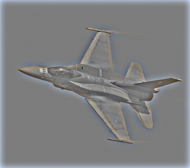
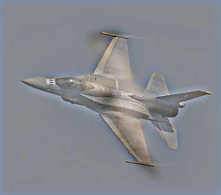
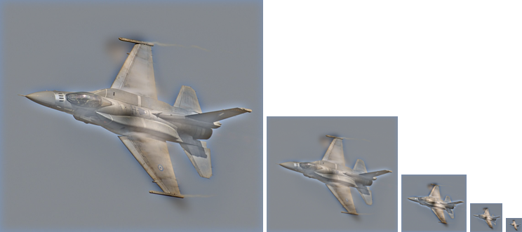
</td>
</tr>

<tr>
<td>
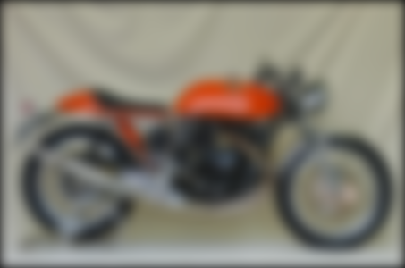
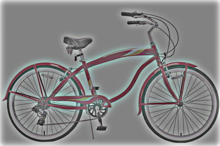
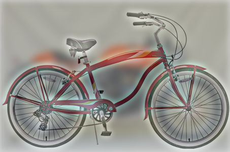
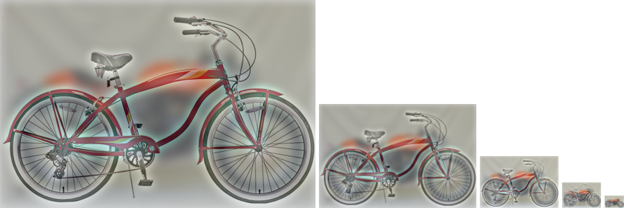
</td>
</tr>

<tr>
<td>


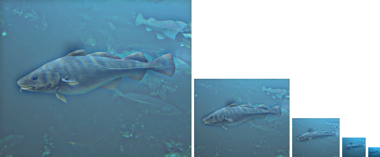
</td>
</tr>

</table>
